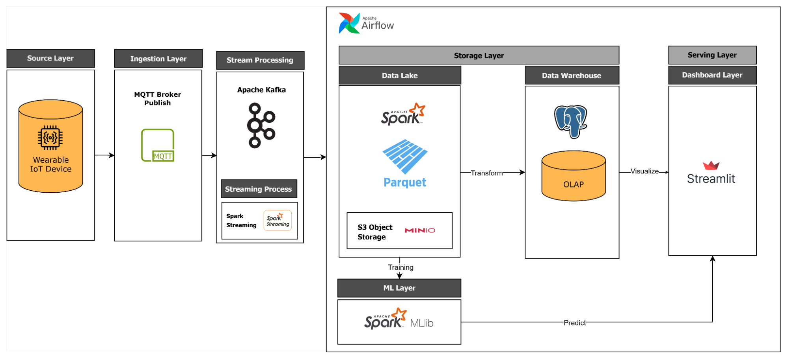

# Realtime Wearable Sensor Data Engineering Pipeline

A real-time data engineering pipeline that ingests wearable sensor data via MQTT, processes it with Spark MLlib for activity recognition, and serves analytics through a Tableau dashboard backed by PostgreSQL.

Dataset: [Daily and Sports Activities — UCI ML Repository](https://archive.ics.uci.edu/dataset/256/daily+and+sports+activities)

---

## Architecture



---

## Stack

| Layer | Technology |
|---|---|
| Ingestion | MQTT (Mosquitto — external) |
| Message Broker | Apache Kafka (KRaft mode) + Schema Registry |
| Object Storage | MinIO (S3-compatible) |
| Stream Processing | Apache Spark 3.5.1 + MLlib |
| Data Warehouse | PostgreSQL 15 |
| Orchestration | Apache Airflow 2.9.1 |
| Dashboard | Streamlit |

---

## Services

| Service | Port | Description |
|---|---|---|
| Kafka Broker | `9092` | Message broker (KRaft, no Zookeeper) |
| Schema Registry | `8083` | Avro schema management |
| Kafka UI | `8080` | Web UI for Kafka topics and messages |
| MinIO | `9000` / `9002` | S3-compatible object storage + console |
| Spark Master | `8081` / `7077` | Spark cluster master UI and submit port |
| PostgreSQL (OLAP) | `5432` | Data warehouse for aggregated results |
| Streamlit | `8501` | Analytics dashboard |
| Airflow Webserver | `8084` | DAG management and monitoring |

> **Note:** Mosquitto MQTT broker runs as an external service on port `1883`.

---

## Getting Started

### Prerequisites
- Docker and Docker Compose installed
- Mosquitto running externally on port `1883`

### Run the stack

```bash
docker compose up -d
```

### Access services

- Kafka UI: http://localhost:8080
- MinIO Console: http://localhost:9002 — `admin / password123`
- Spark Master UI: http://localhost:8081
- Airflow: http://localhost:8084 — `admin / admin`
- Streamlit Dashboard: http://localhost:8501

---

## Pipeline Flow

```
Wearable Sensors
      │
      ▼
MQTT Broker (external)
      │
      ▼
Kafka Topic (raw sensor data)
      │
      ├──► MinIO (raw data lake)
      │
      ▼
Spark Streaming + MLlib
(activity classification)
      │
      ├──► MinIO (processed data)
      │
      ▼
PostgreSQL (aggregated results)
      │
      ▼
Streamlit Dashboard
```

---

## Dataset

The pipeline simulates 19 daily and sports activities (sitting, walking, running, cycling, etc.) recorded by 45 sensors across 5 body units at 25 Hz.

Source: [UCI Daily and Sports Activities Dataset](https://archive.ics.uci.edu/dataset/256/daily+and+sports+activities)
